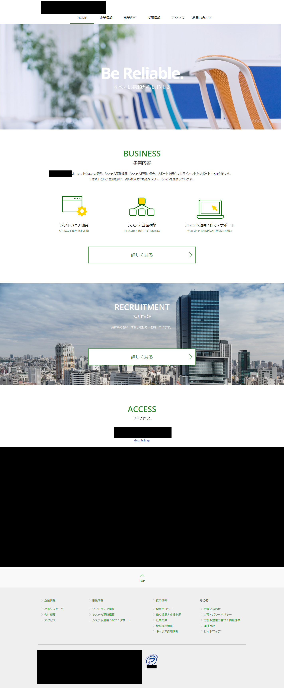
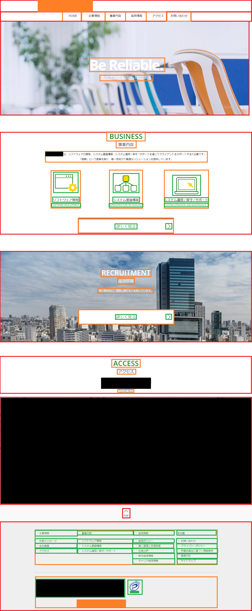

# ホームページ作成

## 全体像


## 画面イメージ



## Visual Studio Code インストール

- 公式サイトから最新版をダウンロード(https://code.visualstudio.com/)
- 「VSCodeUserSetup-x64-x.xx.x.exe」を実行して画面の指示に従ってインストール（デフォルト設定からの変更なし）

## NodeJs インストール

- 公式サイトから最新(推奨)の.zip をダウンロード(https://nodejs.org/ja/)
- 7z で解凍
- 「node-vxx.xx.x-win-x64」フォルダを任意の場所にコピー
- 「Windows メニュー」⇒「Windows システムツール」⇒「コントロールパネル」を選択
- 「システム」を選択
- 左メニューの「システムの詳細設定」を選択
- 「環境変数」ボタンを押下
- 「システム環境変数」の path に node-vxx.xx.x-win-x64 がある場所のフルパスを追加
  - （例：D:\APP\node\node-vxx.xx.x-win-x64）

## node インストール確認

- Windows PowerShell を起動
- 以下のコマンド実行（Version が表示されれば OK）
  - `node --version`
- 以下のコマンド実行（Version が表示されれば OK）
  - `npm --version`

## yarn インストール

- Windows PowerShell を起動
- 以下のコマンド実行（yarn のインストール）
  - `npm install -g yarn`

## ポリシー変更（yarn を実行するため）

- Windows PowerShell を「管理者権限」で開く
- 以下のコマンド実行
  - `Set-ExecutionPolicy RemoteSigned`
  - Y を入力
- 以下のコマンド実行（Version が表示されれば OK）
  - `yarn --version`

## Visial Studio Code 拡張機能インストール

- Visial Studio Code を起動

  - 下記の拡張機能をインストールする
    | 拡張機能名 | 説明 |
    | :---------- | :--------------------------------------------------------------------------------- |
    | Japanese Language Pack For Visual Studio Code | VSCode を日本語化してくれる拡張機能 |
    | Material Icon Theme | ファイルツリーのアイコンをマテリアルアイコンに変更することができる拡張機能 |
    | Live Server | Web サイトを PC 上で確認することができるローカルサーバーを簡単に立ち上げることができるできる拡張機能 |
    | Live Sass Compiler | VSCode で記述した Sass ファイルを CSS にコンパイルしてくれる拡張機能(Last Update Date が新しいもの) |
    | JS & CSS Minifier (Minify) | javascript と css を圧縮・軽量化(Minify)する拡張機能 |
    | Highlight Matching Tag | 開始タグと終了タグのペアを分かりやすく表示してくれる拡張機能 |
    | indent-rainbow | インデントの階層ごとに色を付けてくれる拡張機能 |
    | EditorConfig for VS Code | コーディングスタイルを統一するため拡張機能 |
    | Prettier - Code formatter | コードをきれいにフォーマットするための拡張機能 |
    | Sorting HTML and Jade attributes | HTML 属性をソートするための拡張機能 |
    | HTMLHint | HTML のエラーなどを表示することができる拡張機能 |
    | stylelint | CSS ファイルや SCSS ファイルの構文エラーを検知したり、エラーを自動修復するための拡張機能 |
    | ESLint | JavaScript や TypeScript の構文エラーを検知できる拡張機能 |
    | Code Spell Checker | 英単語のスペルチェックをしてくれる拡張機能 |
    | HTML CSS Support | CSS 側で作った Class 名が候補に出るようになる拡張機能 |

## Visial Studio Code 設定

- ルートフォルダに「.vscode」フォルダを作成
- 「setting.json」ファイルを作成
- 以下の内容で保存

```
{
  "attrsSorter.order": ["id", "name", "class"], // HTML属性ソート順
  "csscomb.preset": "./csscomb.json", // CSSプロパティソート設定ファイル
  "csscomb.formatOnSave": true, // 保存時にCSSプロパティソート
  "editor.codeActionsOnSave": {
    "source.fixAll.eslint": true // 保存時にESLint実行
    "source.fixAll.stylelint": true // 保存時にStyleLint実行
  },
  "editor.defaultFormatter": "esbenp.prettier-vscode", // エディタフォーマッター
  "editor.formatOnSave": true, // 保存時にフォーマット
  "editor.renderWhitespace": "all", // 半角スペースを可視化
  "editor.renderControlCharacters": true, // 制御文字を可視化
  "explorer.compactFolders": false, // エクスプローラーのフォルダ階層をまとめない
  "files.exclude": {
    "**/node_modules": true // エクスプローラーからnode_modulesを除外
  },
  "javascript.updateImportsOnFileMove.enabled": "always", // javascript編集時に同時にパスなどを変更
  "typescript.updateImportsOnFileMove.enabled": "always", // typescript編集時に同時にパスなどを変更
  "liveSassCompile.settings.compileOnWatch": false, // (SCSS)初回にコンパイルしない
  "liveSassCompile.settings.generateMap": false, // (SCSS)mapファイルを作成しない
  "liveSassCompile.settings.formats": [
    {
      "format": "compressed", // 1行に圧縮
      "extensionName": ".min.css", // ファイル名
      "savePath": "/css", // 保存先
      "savePathSegmentKeys": null,
      "savePathReplaceSegmentsWith": null
    }
  ],
  "stylelint.validate": ["scss"], // StyleLintの対象をSCSSのみ
  "css.validate": false, // Visial Studio Codeのcssバリデーションを除外
  "less.validate": false, // Visial Studio Codeのlessバリデーションを除外
  "scss.validate": false, // Visial Studio Codeのscssバリデーションを除外
  "workbench.iconTheme": "material-icon-theme", // エクスプローラーのアイコン
  "workbench.tree.indent": 20, // エクスプローラーのツリーインデント幅
}
```

## EditorConfig 設定

- ルートフォルダに「.editorconfig」ファイルを作成
- 以下の内容で保存

```
root = true

[*]
charset = utf-8 // 文字コード
end_of_line = lf // 改行コード
indent_size = 2 // インデント幅
indent_style = space // インデント
max_line_length = 120 // 1行の最大文字数
trim_trailing_whitespace = true // 末尾の半角スペースを除去
insert_final_newline = true // ファイルの末尾を改行で補完(GitHubは末尾が改行になっていないと警告が出るため)

[*.md]
max_line_length = 0
trim_trailing_whitespace = false
```

## Prettier 設定

- ルートフォルダに「.prettierrc」ファイルを作成
- 以下の内容で保存

```
{
  "arrowParens": "always", // アロー関数の()を省略しない
  "semi": true, // 行末にセミコロンを付与
  "singleQuote": true // シングルクォーテーション
}
```

## Code Spell Checker 設定

- ルートフォルダに「cspell.json」ファイルを作成
- 以下の内容で保存

```
{
  "version": "0.2",
  "language": "en",
  "words": ["Kaku"], // 除外するワード
  "flagWords": ["hte"], // 常にNGとするワード
  "ignorePaths": [ // 除外するパス
    ".git",
    ".gitignore",
    ".vscode",
    ".editorconfig",
    ".prettierrc",
    "cspell.json",
    "csscomb.json",
    "./node_modules",
    "README.md",
    "images"
  ]
}
```

## CSSComb 設定

- ルートフォルダに「csscomb.json」ファイルを作成
- ジェネレータサイトがあるので自分の好みの設定で作成（https://csscomb.herokuapp.com/config）

## ESLint 導入（任意）

- 以下のコマンド実行（ESLint のインストール）
  - `yarn add --dev eslint`
- 以下のコマンド実行（ESLint の初期化 対話式で設定）
  - `yarn eslint --init`
  - 以下の設定を選択
  ```
  √ How would you like to use ESLint? · problems
  √ What type of modules does your project use? · esm
  √ Which framework does your project use? · none
  √ Does your project use TypeScript? · No / Yes
  √ Where does your code run? · browser
  √ What format do you want your config file to be in? · JSON
  √ Would you like to install them now? · No / Yes
  √ Which package manager do you want to use? · yarn
  ```
- 以下のコマンド実行（ESLint のコードフォーマットに関連するルールを無効化し、prettier コードフォーマットを優先させるプラグイン）
  - `yarn add --dev eslint-config-prettier`
- 以下のコマンド実行（import ソートおよび不要な import を削除するプラグイン）
  - `yarn add --dev eslint-plugin-import eslint-plugin-unused-imports`
- 作成された「.eslintrc.json」を以下の内容で保存
  ```
  {
    "env": {
      "browser": true,
      "es2021": true,
      "jquery": true
    },
    "extends": ["eslint:recommended", "plugin:@typescript-eslint/recommended", "eslint-config-prettier"],
    "parser": "@typescript-eslint/parser",
    "parserOptions": {
      "ecmaVersion": "latest",
      "sourceType": "module"
    },
    "plugins": ["@typescript-eslint"],
    "rules": {
      "@typescript-eslint/no-unused-vars": "off",
    }
  }
  ```

## StyleLint 導入（任意）

- 以下のコマンド実行
  - `yarn add --dev stylelint stylelint-config-standard stylelint-scss stylelint-config-standard-scss stylelint-config-prettier`
- ルートフォルダに「.stylelintrc.json」を作成
- 以下の内容で保存

```
{
  "plugins": ["stylelint-scss"],
  "extends": ["stylelint-config-standard", "stylelint-config-standard-scss", "stylelint-config-prettier"],
  "rules": {
    "string-quotes": "single" // シングルクォート
  }
}
```

## TypeScript 導入（任意）

- TypeScript の設定ファイルを作成するために以下のコマンド実行
  - `yarn run tsc --init`
- ts ファイルの変更を監視して js ファイルを生成するために以下のコマンド実行
  - `yarn run tsc -w`

## SCSS→CSS コンバート

- Visual Studio Code の右下バーの Watch Sass を押下することで scss ファイル保存時に css にコンバートしてくれる
  

## ResetCSS

- ブラウザによって見え方が変わらないようブラウザがデフォルトで持っている CSS を打ち消す CSS
- 今回は h1 タグであっても h2 タグであっても共通の大きさに設定される destyle.css を採用
- 0 からスタイリングする場合におすすめのリセット CSS

https://github.com/nicolas-cusan/destyle.css

## HTML Living Standard

- HTML Living Standard とは、Apple・Mozilla・Opera の開発者によって設立された WHATWG という組織が策定する HTML の仕様のこと
- HTML5 の廃止によって標準仕様となった
- 正しい書き方をすれば SEO の効果を得られる！という記事が多いが、記事の質や表示速度の方がよっぽど重要

- イメージ
  　
- ボイラープレート
  - 参考サイト
    https://goodlife.tech/posts/html5

```
<!DOCTYPE html> // HTML5 で記述されているという事を示す
<html lang="ja"> // 言語を指定することが推奨されており lang="ja" とすることで日本語であることを示す
  <head>
    <meta charset="utf-8" /> // ページで使用している文字エンコーディングを指定
    <title>テンプレート</title> // ページの題名を指定(Google検索結果のタイトルや、タブに表示される)
    <meta name="description" content="" /> // ぺージの説明を指定(Google検索結果の詳細に表示される)
    <meta name="viewport" content="width=device-width, initial-scale=1" /> // 表示領域を示し、ページが表示されたときの初期倍率を指定。表示する端末の画面サイズやブラウザアプリに応じて幅が変化(https://image.itmedia.co.jp/ait/articles/1610/13/wi-fig01.png)

    <meta property="og:title" content="" /> // Twitter, Facebook, Lineなどがサポートしており記事などがシェアされた時、設定したページのタイトルやイメージ画像、詳細などを伝える
    <meta property="og:type" content="" />
    <meta property="og:url" content="" />
    <meta property="og:image" content="" />

    <link rel="apple-touch-icon" href="icon.png" /> //  iPhone や iPad の safari ・ Android 等で Web サイトをホーム画面に追加した時に表示されるアイコンを指定
    <link rel="icon" href="./images/favicon.ico" /> // Web ブラウザでサイトを開いた時にタブに表示されるアイコン
    <link rel="icon" href="./images/favicon.svg" type="image/svg+xml" />

    <link rel="stylesheet" href="css/normalize.css" /> // リセットCSS
    <link rel="stylesheet" href="css/index.css" /> // アプリケーションCSS
  </head>

  <body>
    <header> // Webサイトにおけるヘッダーを明示するタグ
    </header>
    <nav> // Webサイト内でナビゲーションリンクであることを明示するタグ
      <ul>
        <li>
        </li>
      </ul>
    </nav>
    <main> // HTML文書内の主要コンテンツであることを明示するタグ。同一HTML文書内に1つのみになるようにする
      <article> // ブロク記事のように自己完結するコンテンツを明示するタグ
        <section> // Webサイト内で文章のまとまりを明示するタグ。基本的に子要素に見出し（h1〜h6）を持つ
          <h1></h1>
        </section>
      <article>
    </main>
    <aside> // サイドバーのように補助的なコンテンツを明示するタグ。広告、人気記事、新着記事、SNSシェアボタンなどのコンテンツを含んだ形で使用
    </aside>
    <footer> // Webサイト内のフッターを明示するタグ
    </footer>
    <script src="js/index.js"></script> // javascriptはbodyの直前に配置することでHTMLの描画の邪魔にならない
  </body>
</html>
```

## 作成イメージ

- 分かりやすいように各要素に枠をつけてどこにどの要素を作るべきかまずイメージ
- 赤枠が外枠、橙枠、緑枠が内枠
  

## Grid レイアウト

2 次元のレイアウトを作るときにおすすめ
https://coliss.com/articles/build-websites/operation/css/grid-for-layout-flexbox-for-components.html

## Flex レイアウト

1 次元のレイアウトを作るときにおすすめ

## margin の方向

top なら top、right なら right で方向を統一すること。
理由は 2 つ。可読性の問題。もう 1 点は仕様の問題。
2 点目は上に並んでいる要素で maring-bottom を指定して、下に並んでいる要素に maring-top を指定すると打ち消しあってしまう事象がある。

## ICON

https://fonts.google.com/icons?selected=Material+Icons

# CSS

## ピュア CSS によるチェックリスト

```
<div class="checklist">
  <h2>Item Checklist with CSS</h2>
  <label>
    <input type="checkbox" name="" id="" />
    <i></i>
    <span>Item #1</span>
  </label>
</div>

.checklist {
    padding: 50px;
    position: relative;
    background: #043b3e;
    border-top: 50px solid #03a2f4;
}
.checklist label {
    position: relative;
    display: block;
    margin: 40px 0;
    color: #fff;
    font-size: 24px;
    cursor: pointer;
}
.checklist input[type="checkbox"] {
    -webkit-appearance: none;
}
.checklist i {
    position: absolute;
    top: 2px;
    display: inline-block;
    width: 25px;
    height: 25px;
    border: 2px solid #fff;
}
.checklist input[type="checkbox"]:checked ~ i {
    top: 1px;
    height: 15px;
    width: 25px;
    border-top: none;
    border-right: none;
    transform: rotate(-45deg);
}
```

## is()と:where()による要素のスタイル

```
/_ 見出し要素内の b 要素を選択し、カラーを変更します。 _/
:where(h2,h3,h4) > b {
  color: yellow;
}
```

## キーフレームを使用したアコーディオン

```
<main>
  <details open>
    <summary>Accordion Tab #1</summary>
    <div class="tab-content">
      <p>your text goes here</p>
    </div>
  </details>

    <details>
    <summary>Accordion Tab #2</summary>
    <div class="tab-content">
      <p>your text goes here</p>
    </div>
  </details>
      <details>
    <summary>Accordion Tab #3</summary>
    <div class="tab-content">
      <p>your text goes here</p>
    </div>
  </details>
</main>

/* .tab-contentは好きなようにスタイルできます */
main {
  max-width: 400px;
  margin: 0 auto;
}
p {
    text-align: justify;
    font-family: monospace;
    font-size: 13px;
}
summary {
  font-size: 1rem;
  font-weight: 600;
  background-color: #f3f3f3;
  color: #000;
  padding: 1rem;
  margin-bottom: 1rem;
  outline: none;
  border-radius: 0.25rem;
  cursor: pointer;
  position: relative;
}
details[open] summary ~ * {
  animation: sweep .5s ease-in-out;
}
@keyframes sweep {
  0%    {opacity: 0; margin-top: -10px}
  100%  {opacity: 1; margin-top: 0px}
}
details > summary::after {
  position: absolute;
  content: "+";
  right: 20px;
}
details[open] > summary::after {
  position: absolute;
  content: "-";
  right: 20px;
}
details > summary::-webkit-details-marker {
  display: none;
}
```

## ::before を使用してボタンの前にアイコンを追加

```
<div class="card">
  <div class="card-body">
    <a href="" target="_blank" class="wp-block-button btn btn-web btn-primary" rel="noopener">Website</a>
    <a href="" target="_blank" class="wp-block-button btn btn-docu btn-primary" rel="noopener">Documentation</a>
    <a href="" target="_blank" class="wp-block-button btn btn-gh btn-primary" rel="noopener">GitHub</a>
  </div>
</div>

/* グローバルボタンのスタイルを定義した後で、アイコンや画像を使用するカスタムのボタンクラスを定義します。 */

.btn-primary .btn-docu:before {
  content:"\0000a0";
  display:inline-flex;
  height:24px;
  width:24px;
  line-height:24px;
  margin:0px 10px 0px 0px;
  position:relative;
  top:0px;
  left:0px;
  background:url(https://stackdiary.com/docu.svg) no-repea left center transparent;
  background-size:100% 100%;
}
```

# Ajax 通信

axios

```
<script src="https://cdn.jsdelivr.net/npm/axios/dist/axios.min.js"></script>
```

# CSS 結合子
